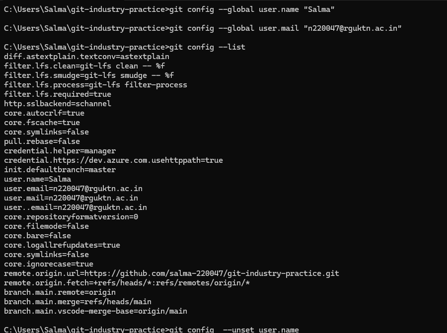
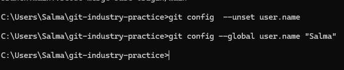
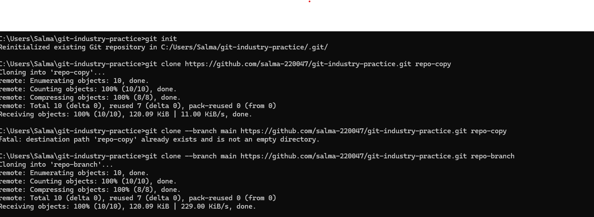

# Git Industry Level Commands Practice

---

## 1. Git Configuration Commands

### Command
git config --global user.name

Syntax
git config --global user.name "username"

Purpose
Sets the username for Git commits.

Example
git config --global user.name "Salma"

Screenshot

---

### Command
git config --global user.email

Syntax
git config --global user.email "email"

Purpose
Sets the email for Git commits.

Example
git config --global user.email "salma@email.com"

Screenshot

---

### Command
git config --list

Syntax
git config --list

Purpose
Displays all Git configuration settings.

Example
git config --list

Screenshot

---

### Command
git config --unset

Syntax
git config --unset user.name

Purpose
Removes a Git configuration value.

Example
git config --unset user.name

Screenshot

---

### Command
git config --global user.name

Syntax
git config --global user.name "username"

Purpose
Sets username again.

Example
git config --global user.name "Salma"

Screenshot

## 2. Repository Setup Commands

### Command
git init

Syntax
git init

Purpose
Initializes a new Git repository.

Example
git init

Screenshot

### Command
git clone

Syntax
git clone repository-url

Purpose
Creates a copy of a remote repository.

Example
git clone https://github.com/user/repo.git

Screenshot

---

### Command
git clone --branch

Syntax
git clone --branch branch-name repository-url

Purpose
Clones a specific branch from repository.

Example
git clone --branch main repo-url

Screenshot

---

### Command
git clone --depth

Syntax
git clone --depth 1 repository-url

Purpose
Creates shallow clone with limited history.

Example
git clone --depth 1 repo-url

Screenshot

---

### Command
git status

Syntax
git status

Purpose
Shows current repository status.

Example
git status

Screenshot

